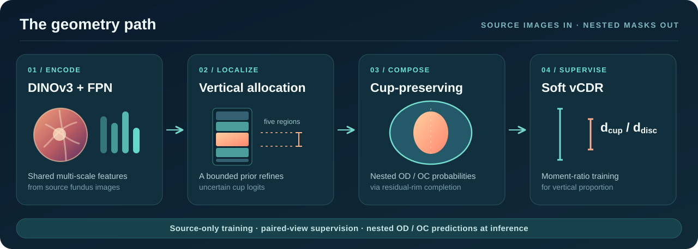

<h1 align="center">CuPGeo</h1>

<strong>Beyond Containment · 超越杯盘包含</strong>

面向跨域视盘与视杯分割的杯保持嵌套几何框架

  <a href="#方法概览">方法</a> ·
  <a href="#快速开始">快速开始</a> ·
  <a href="#论文实验协议">实验协议</a> ·
  <a href="#代码地图">代码地图</a> ·
  <a href="README.md">English</a>

源域训练 · MIT 开源研究代码

---

## 方法概览

CuPGeo 以视杯为几何锚点：**VRA** 给杯位置提供有界的竖直先验，**CP** 用杯概率与残余盘缘概率构造嵌套输出，**soft-vCDR** 在源域训练时约束杯盘的相对竖直尺度。目标域只做冻结推理，不进行测试时适应。

  

| 模块 | 作用 |
| :--- | :--- |
| **VRA** | 五区域竖直分配，在视杯预测不确定处施加有界校正。 |
| **CP** | 用视杯和残余盘缘合成视盘，确保 OD 概率逐像素不小于 OC 概率。 |
| **soft-vCDR** | 用软掩码的二阶矩尺度构造可微的杯盘竖直比例监督。 |

核心关系是 **POD = POC + (1 − POC) Prim**。共同阈值下，预测的视杯始终包含在视盘内。stop-gradient 只改变训练时盘侧梯度流向，不改变前向概率。

## 快速开始

下面的命令安装代码、检查发布文件，并**打印**匹配消融的训练计划。没有加 <code>--execute</code> 时不会启动训练。

~~~bash
git clone https://github.com/ljxboool/CuPGeo.git
cd CuPGeo

# 先安装与你的硬件匹配的 PyTorch / torchvision。
python -m pip install -e '.[dev,analysis]'
python -m scripts.check_release
python -m scripts.plan_experiments --suite matched --seeds 0 1 2
~~~

数据集和 DINOv3-L/16 底座需单独取得。准备方法见[数据说明](docs/DATA.md)，实验入口见[实验与代码对应表](docs/EXPERIMENTS.md)。原始实验底座的 SHA-256 为 <code>45172f209c9583c40538afc26b60a07033e6fcc2e8c30228338e6b2e932e7941</code>；仅下载同名新版权重不能证明初始化相同。

## 论文实验协议

| 实验 | 初始化 | 训练预算 | 选模 |
| :--- | :--- | :--- | :--- |
| 共享骨干的主对比 | 预训练底座 | 120 epochs | 源验证 Mean Dice |
| 组件与 stop-gradient 消融 | 每个 seed 对应的 CP 120-epoch checkpoint | 每个变体独立再训练 120 epochs，CP-only 也续训 | 源验证 Mean Dice |

匹配消融先按 seed 各训练一次 CP，再从**同一个 CP checkpoint**分别启动 CP-only、完整 CuPGeo、w/o ratio、w/o VRA、完整模型 w/o SG；变体之间不串行继承。目标域标签仅用于冻结预测后的评估。四个目标域为 **BinRushed、Magrabia、RIM-ONE DL 和 PAPILA**；每个 seed 内先对四域等权平均，再计算跨 seed 均值与样本标准差。

准备好数据和权重后，显式执行训练计划：

~~~bash
CUDA_VISIBLE_DEVICES=0 python -m scripts.plan_experiments \
  --suite matched --seeds 0 1 2 --execute
~~~

训练、初始化与断点续训的直接命令见[实验说明](docs/EXPERIMENTS.md)。<code>--init-checkpoint</code> 只加载模型参数并开始全新的第二阶段；<code>--resume</code> 用于恢复中断的训练。预测与计分分别由 [<code>scripts/evaluate.py</code>](scripts/evaluate.py) 和 [<code>scripts/score_predictions.py</code>](scripts/score_predictions.py) 完成，比例代理与直径分析见 [<code>scripts/analyze_ratio_geometry.py</code>](scripts/analyze_ratio_geometry.py)。

## 代码地图

| 路径 | 内容 |
| :--- | :--- |
| [<code>c3tta/models/</code>](c3tta/models) | DINOv3、LoRA、Pyramid-FPN、VRA 与嵌套输出构造 |
| [<code>c3tta/losses/</code>](c3tta/losses) | OD/OC、VRA、soft-vCDR 及固定辅助损失 |
| [<code>c3tta/data/</code>](c3tta/data) | 数据读取、规范化掩码、双视图增强与几何目标 |
| [<code>configs/</code>](configs) | 完整模型、消融、共享骨干对照与比例权重 |
| [<code>scripts/</code>](scripts) | 数据转换、训练、冻结预测、评分与分析 |
| [<code>docs/</code>](docs) | [数据](docs/DATA.md) · [实验](docs/EXPERIMENTS.md) · [来源](docs/PROVENANCE.md) · [验证](docs/VALIDATION.md) |

历史 Python 包名 <code>c3tta</code> 为 checkpoint 兼容性保留；论文方法不进行测试时自适应。

## 发布范围

仓库只发布**源码、配置、测试与说明**，不含眼底数据、预训练或训练权重、各 seed 的 checkpoint、预测、指标文件、凭据与服务器启动脚本。发布检查验证代码语法、配置一致性与文件哈希；代码公开本身不等于重新跑出论文数值。

~~~bash
python -m scripts.check_release
python -m unittest discover -s tests -p test_release_plan.py
python -m pytest -q
CUDA_VISIBLE_DEVICES='' OMP_NUM_THREADS=2 python -m scripts.smoke_test
~~~

smoke test 使用合成图像和小型骨干。源码采用 [MIT 许可证](LICENSE)；数据集、预训练模型和第三方依赖分别遵守各自条款。引用信息见 [<code>CITATION.cff</code>](CITATION.cff)。
