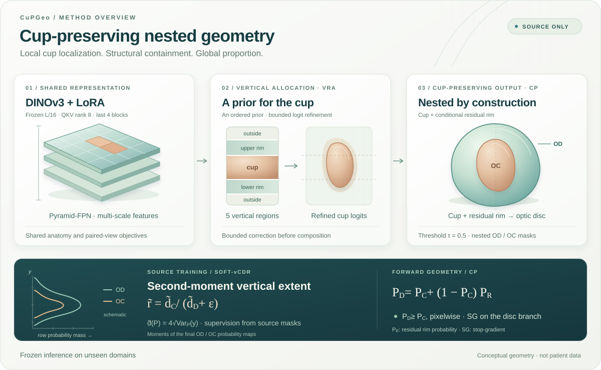
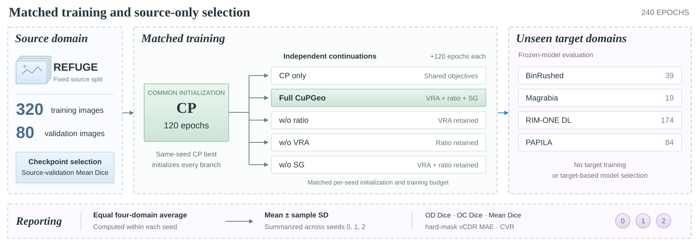

<a id="top"></a>
<p align="center"></p>
<h1 align="center">CuPGeo</h1>
<p align="center"><strong>Beyond Containment · 超越杯盘包含</strong></p>
<p align="center">面向跨域视盘与视杯分割的杯保持嵌套几何框架</p>
<p align="center"><sub>Jiaxiang Liang · Haodi An · Yuetao He · Miao Gao · Bola Nasifu · Yikemaiti Sataer</sub></p>
<p align="center"><sub>源域训练 · MIT 开源研究代码</sub></p>
<p align="center"><a href="https://github.com/ljxboool/CuPGeo/actions/workflows/source-checks.yml"></a></p>

<p align="center">
  <a href="#方法概览">方法</a> ·
  <a href="#快速开始">快速开始</a> ·
  <a href="#论文实验协议">实验协议</a> ·
  <a href="#reported-results">结果</a> ·
  <a href="#代码地图">代码地图</a> ·
  <a href="#citation">引用</a> ·
  <a href="README.md">English</a>
</p>

---

##  方法概览

CuPGeo 以视杯为几何锚点：**VRA** 给杯位置提供有界的竖直先验，**CP** 用杯概率与残余盘缘概率构造嵌套输出，**soft-vCDR** 在源域训练时约束杯盘的相对竖直尺度。目标域只做冻结推理，不进行测试时适应。

<p align="center">
  <picture>
    <source media="(max-width: 640px) and (prefers-color-scheme: dark)" srcset="assets/cupgeo-method-mobile-dark.svg">
    <source media="(max-width: 640px)" srcset="assets/cupgeo-method-mobile.svg">
    <source media="(prefers-color-scheme: dark)" srcset="assets/cupgeo-method-dark.svg">
    
  </picture>
</p>
<p align="center"><sub>上方为整体流程，下方展开 VRA、CP 与 soft-vCDR · 蓝色：VRA · 绿色：CP · 紫色：soft-vCDR<br>OD：视盘 · OC：视杯 · 缩略图为合成矢量示意 · <a href="assets/cupgeo-method.svg">查看大图</a> · <a href="assets/cupgeo-method-mobile.svg">竖版图</a></sub></p>

| 模块 | 作用 |
| :--- | :--- |
| **VRA** | 五区域竖直分配，在视杯预测不确定处施加有界校正。 |
| **CP** | 用视杯和残余盘缘合成视盘，确保 OD 概率逐像素不小于 OC 概率。 |
| **soft-vCDR** | 用软掩码的二阶矩尺度构造可微的杯盘竖直比例监督。 |

核心关系是 **P<sub>OD</sub> = P<sub>OC</sub> + (1 − P<sub>OC</sub>) P<sub>rim</sub>**。共同阈值下，预测的视杯始终包含在视盘内。stop-gradient 只改变训练时盘侧梯度流向，不改变前向概率。

##  快速开始

下面的命令安装代码、检查发布文件，并**打印**匹配消融的训练计划。没有加 <code>--execute</code> 时不会启动训练。

~~~bash
git clone https://github.com/ljxboool/CuPGeo.git
cd CuPGeo

# 先安装与你的硬件匹配的 PyTorch / torchvision。
python3 -m pip install -e '.[dev,analysis]'
python3 -m scripts.check_release
python3 -m scripts.plan_experiments --suite matched --seeds 0 1 2
~~~

数据集和 DINOv3-L/16 底座需单独取得。准备方法见[数据说明](docs/DATA.md)，实验入口见[实验与代码对应表](docs/EXPERIMENTS.md)。

<details>
<summary>原始底座权重标识</summary>

原始实验底座的 SHA-256 为：

```text
45172f209c9583c40538afc26b60a07033e6fcc2e8c30228338e6b2e932e7941
```

仅下载同名新版权重不能证明初始化相同，准备步骤见[底座说明](docs/DATA.md)。

</details>

##  论文实验协议

CuPGeo 的源域只使用 **REFUGE**：320 张训练，80 张留出用于 checkpoint 与超参数选择。四个目标评估集为 **BinRushed 39 张、Magrabia 19 张、RIM-ONE DL 174 张、PAPILA 84 张**。CuPGeo 不使用目标域图像或标注训练与选模；划分与转换见[数据准备](docs/DATA.md)。

<p align="center">
  <picture>
    <source media="(max-width: 640px) and (prefers-color-scheme: dark)" srcset="assets/cupgeo-protocol-mobile-dark.svg">
    <source media="(max-width: 640px)" srcset="assets/cupgeo-protocol-mobile.svg">
    <source media="(prefers-color-scheme: dark)" srcset="assets/cupgeo-protocol-dark.svg">
    
  </picture>
</p>
<p align="center"><sub>CuPGeo 匹配 240-epoch 训练流程 · 仅使用源验证集选模 · <a href="assets/cupgeo-protocol.svg">查看大图</a> · <a href="docs/EXPERIMENTS.md">完整执行命令</a></sub></p>

| 论文实验 | 初始化与训练预算 | 入口 |
| :--- | :--- | :--- |
| 主对比（Table 1） | **总计 240 epochs**：CuPGeo 复用 CP 120 + Full 120 的 checkpoint；MixStyle、DSU 各自从预训练底座训练 240 epochs | CuPGeo 用 `--suite matched`；共享骨干基线用 `--suite single` |
| 组件消融（Table 2） | CP 预训练 120 epochs；每个变体从**同 seed 的 CP 最佳 checkpoint**独立续训 120 epochs，CP-only 也续训 | `--suite matched` |
| stop-gradient 消融（Table 3） | Full 与 w/o SG 从相同 seed 的 CP checkpoint 出发，其余目标一致 | `--suite matched --variants full no_sg` |
| soft-vCDR 权重研究（Table 4，源验证） | 复用匹配的 CP 初始化；0.25–3.00 共七档，2.00 对应完整模型 | [额外六档权重的完整命令](docs/EXPERIMENTS.md#source-validation-weight-study) |
| 比例代理验证（Table 5） | 复用 Full 和 w/o ratio 的冻结预测，不额外训练 | `scripts/analyze_ratio_geometry.py` |

<a id="reported-results"></a>

###  论文结果

论文 Table 1 在 240-epoch 设置下报告四域等权平均、跨 seeds 0–2 的均值 ± 样本标准差：

| 方法 | Mean Dice ↑ | OC Dice ↑ | vCDR MAE ↓ | CVR (%) ↓ |
| :--- | ---: | ---: | ---: | ---: |
| MixStyle | 0.7375 ± 0.0070 | 0.6339 ± 0.0020 | 0.1405 ± 0.0106 | 31.30 ± 2.05 |
| DSU | 0.7395 ± 0.0096 | 0.6362 ± 0.0026 | 0.1349 ± 0.0038 | 32.71 ± 3.57 |
| **CuPGeo** | **0.7962 ± 0.0031** | **0.7019 ± 0.0078** | **0.0949 ± 0.0085** | **0.00 ± 0.00** |

<sub>Mean Dice = (OD Dice + OC Dice) / 2。CVR 为存在任一预测视杯像素落在预测视盘外的图像占比，以百分数表示。vCDR MAE 根据阈值化掩码计算。↑ 越高越好；↓ 越低越好。</sub>

仓库内这些方法采用 seeds **0、1、2**，768×768 输入，冻结 DINOv3-L/16，最后四层 QKV 使用 rank-8 LoRA，Pyramid-FPN 解码器；fp16、batch size 4、梯度累积 4。AdamW 的 decoder/LoRA 学习率分别为 2.5×10⁻⁴ / 5×10⁻⁵，weight decay 10⁻⁴，预热 5 epochs 后余弦衰减至初始值的 10%。每一阶段都根据**源验证 Mean Dice**选 `best.pt`。其余参数见[实验协议](docs/EXPERIMENTS.md)与配置文件。

准备好数据与底座权重后，先查看训练命令；加入 `--execute` 才会执行：

~~~bash
python3 -m scripts.plan_experiments --suite single --seeds 0 1 2
python3 -m scripts.plan_experiments --suite matched --seeds 0 1 2
~~~

匹配消融从同一 CP checkpoint 分别启动 **CP-only、Full、w/o ratio、w/o VRA、Full w/o SG**，不在变体之间串行继承。**Full checkpoint 同时用于 Table 1 的 CuPGeo 和 Table 2 的完整模型**；`single` 只安排 240-epoch 的 MixStyle 与 DSU。额外六档比例权重可用 `--reuse-cp` 复用已有 CP；[完整命令](docs/EXPERIMENTS.md#source-validation-weight-study)见实验说明。`--init-checkpoint` 只加载模型参数，开启新阶段；`--resume` 才恢复中断任务的优化器状态。

预测与计分分别由 [<code>scripts/evaluate.py</code>](scripts/evaluate.py) 和 [<code>scripts/score_predictions.py</code>](scripts/score_predictions.py) 完成：使用相同的 0.5 阈值、单尺度、无翻转集成、无目标域适应。[四域完整评估命令](docs/EXPERIMENTS.md#frozen-four-domain-evaluation)依次生成冻结预测与离线指标；[<code>scripts/aggregate_paper_domains.py</code>](scripts/aggregate_paper_domains.py)先在每个 seed 内对四域等权平均，再计算跨 seed 均值与**样本**标准差，并核查 vCDR 有效样本数。比例代理与直径分析见[完整调用示例](docs/EXPERIMENTS.md#ratio-proxy-and-diameter-analysis)。

##  代码地图

| 路径 | 内容 |
| :--- | :--- |
| [<code>c3tta/models/</code>](c3tta/models) | DINOv3、LoRA、Pyramid-FPN、VRA 与嵌套输出构造 |
| [<code>c3tta/losses/</code>](c3tta/losses) | OD/OC、VRA、soft-vCDR 及固定辅助损失 |
| [<code>c3tta/data/</code>](c3tta/data) | 数据读取、规范化掩码、双视图增强与几何目标 |
| [<code>configs/</code>](configs) | 完整模型、消融、共享骨干对照与比例权重 |
| [<code>scripts/</code>](scripts) | 数据转换、训练计划、冻结预测、评分、论文汇总与几何分析 |
| [<code>docs/</code>](docs) | [数据](docs/DATA.md) · [实验](docs/EXPERIMENTS.md) · [来源](docs/PROVENANCE.md) · [验证](docs/VALIDATION.md) |

历史 Python 包名 <code>c3tta</code> 为 checkpoint 兼容性保留；论文方法不进行测试时自适应。

##  发布范围

仓库只发布**源码、配置、测试与说明**，不含眼底数据、预训练或训练权重、各 seed 的 checkpoint、预测、指标文件、凭据与服务器启动脚本。发布检查验证代码语法、配置一致性与文件哈希；代码公开本身不等于重新跑出论文数值。

[自动检查](.github/workflows/source-checks.yml)会在推送和拉取请求时运行：Python 3.10/3.12 核查发布文件与论文协议，Python 3.11 运行完整测试及 CPU 合成数据训练、预测和评估。比例分析测试还会验证概率图首次导出与复用时的指标完全一致。无需下载数据集或预训练权重。

~~~bash
python3 -m scripts.check_release
python3 -m unittest discover -s tests -p test_release_plan.py
python3 -m pytest -q
CUDA_VISIBLE_DEVICES='' OMP_NUM_THREADS=2 python3 -m scripts.smoke_test
~~~

smoke test 使用合成图像和小型骨干。源码采用 [MIT 许可证](LICENSE)；数据集、预训练模型和第三方依赖分别遵守各自条款。

<a id="citation"></a>

##  引用

使用本代码时，请引用 CuPGeo 论文。作者名单与论文标题维护在 [CITATION.cff](CITATION.cff) 中，正式出版信息将在确定后补充。

<p align="center"><sub><a href="#top">返回顶部 ↑</a> · <a href="LICENSE">MIT 许可证</a> · <a href="docs/VISUALS.md">图形源文件</a></sub></p>
